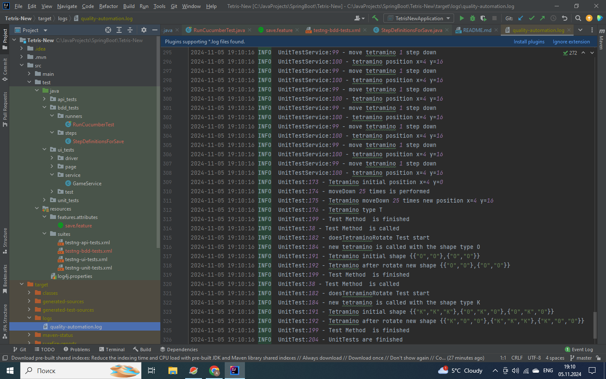

Java Tetris Game Springboot Application

To run the game in Docker do the following steps:

-clone the project to your local repo 

- pack the war file: 

  mvn clean package

- build the image:

  docker build -t tetris-new:0.0.1 .

- run the compose yaml file:

docker-compose -f DockerCompose.yml up

- open browser at http://localhost:8080/hello

- use the profile button to enter the player's room where the player's statistics 
  including the player's last game snapshot and best game snapshot final is depicted.
  After the first game of each player the Mongo data base will be filled with relevant images
  as well as PostgreSQL data base with the player's name and score.

- use the start button to start the game

the game status is shown and changes as the game is saved or is over

- use the relevant buttons to move left, right, rotate, drop down the tetramino or the arrow keys respectfully LEFT,RIGHT,UP,DOWN

- use NewGame button to cancel the current game and start the new game

- use Save button to save the current game, the game new status then will be shown as 'the Game is SAVED'

- use Restart button to call and continue to play the saved game

the current player name and score are shown

as the game is over the current results are saved in the Data base and the best player and the best player's score are selected then and shown

the game speed increases along with the player's score and is shown

The project uses the following technologies:

- Spring Boot
- JSP
- Serialization
- NoSQL (MongoDB) 
- GridFS
- BSON
- PostgreSQL
- Hibernate 
- Lombok
- Playwright Java 
- Docker 

There is a custom test framework for Test Automation created for the project. 

The two most popular hybrid frameworks are used: 

TestNG and BDD Cucumber The following technologies are used here:

- Selenium
- Singleton+Factory
- Page Object
- Page Factory
- REST Assured
- Data Provider
- Gherkin

Java Tetris Tests

There are 16 tests which provide for the game units' functionality:

- run the following maven command to start unit tests:
  
  mvn -DsuiteXml=testng-unit-tests.xml clean test

- each test method is logged for debugging pls find the unit tests log in \target\logs\quality-automation.log

Pls find 8 api tests which make sure that each defined client request receives successful response

from the server and 7 more api tests checking if response bodies are in accordance with client requests:

- run the following maven command to start api tests:

  mvn -DsuiteXml=testng-api-tests.xml clean test

- the test method is logged for debugging pls find the api tests log in \target\logs\quality-automation.log

Pls find 3 UI tests, making sure that the game is saved and then can be restarted at any moment later

- run the following maven command to start ui tests:
  
- mvn -Dbrowser=firefox -DsuiteXml=testng-ui-tests.xml clean test

- the test method is logged for debugging pls find the ui tests log in \target\logs\quality-automation.log

Pls find Cucumber test, reflecting user behaviour driven approach to tests development

- run the following maven command to start api tests:

- mvn -Dbrowser=firefox -DsuiteXml=testng-bdd-tests.xml clean test

- the test method is logged for debugging pls find the bdd tests log in \target\logs\quality-automation.log

Run All tests

 - run the following maven command to run all tests:

 - mvn -Dbrowser=firefox -DsuiteXml=testng-all-tests.xml clean test

 - the test method is logged for debugging pls find all tests log in \target\logs\quality-automation.log

 